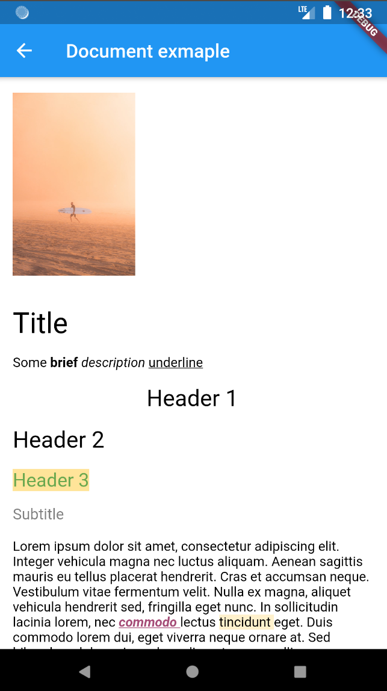

# docs_viewer

A Flutter project which displays basic contents of a Google Docs document.

Detailed article which explains the project is available at https://engineering.nodesagency.com/categories/android/2019/08/21/flutter-google-docs

